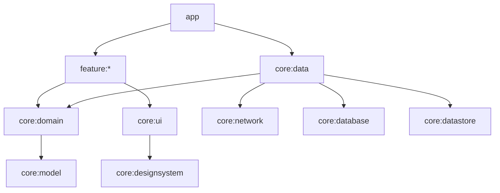

# Android Showcase

[](https://github.com/smogunovandrey66/android-showcase/actions/workflows/ci.yml)

Витрина современных практик Android-разработки на примере небольшого приложения-каталога
персонажей [Rick and Morty API](https://rickandmortyapi.com/): бесконечный список с офлайн-кэшем,
экран деталей, избранное и настройки темы.

## Стек

| Область | Что используется |
|---|---|
| Язык | Kotlin 2.1, Coroutines, Flow |
| UI | Jetpack Compose, Material 3 (dynamic color, dark theme), edge-to-edge, SplashScreen API |
| Архитектура | Clean Architecture, MVVM + UDF (`StateFlow<UiState>`), multi-module |
| DI | Hilt (включая `@HiltViewModel` и `@HiltWorker`) |
| Навигация | Navigation Compose с type-safe маршрутами (`@Serializable` routes) |
| Сеть | Retrofit + OkHttp + kotlinx.serialization |
| Данные | Room (offline-first, single source of truth), Paging 3 + `RemoteMediator`, DataStore |
| Фоновая работа | WorkManager (периодическая синхронизация избранного) |
| Изображения | Coil 3 |
| Сборка | Gradle Version Catalog, convention plugins (`build-logic`), configuration cache |
| Тесты | JUnit, kotlinx-coroutines-test, Turbine, MockK, MockWebServer, Robolectric, Compose UI tests, paging-testing |
| Качество | detekt + ktlint (detekt-formatting), Android Lint, GitHub Actions CI |

## Модули

```
app                      — точка входа: Application, MainActivity, NavHost, нижняя навигация
feature/
  characters             — список персонажей (Paging 3, pull-to-refresh)
  details                — карточка персонажа, добавление в избранное
  favorites              — избранное (работает офлайн)
  settings               — тема и dynamic color (DataStore)
core/
  model                  — доменные модели (чистый Kotlin)
  domain                 — интерфейсы репозиториев и use case'ы (чистый Kotlin)
  data                   — реализации репозиториев, RemoteMediator, WorkManager
  network                — Retrofit API и DTO
  database               — Room: entities, DAO
  datastore              — пользовательские настройки
  common                 — диспетчеры корутин, Result-обёртка
  designsystem           — тема и базовые компоненты
  ui                     — общие Compose-компоненты для фич
  testing                — фейки, тестовые данные, MainDispatcherRule
build-logic/convention   — convention plugins для Gradle
```

Граф зависимостей: `app → feature:* → core:domain → core:model`. Фичи не зависят друг от друга
и ничего не знают о `core:data` — реализации подставляет Hilt в модуле `app`.



## Ключевые приёмы

- **Offline-first.** UI читает данные только из Room, а `CharacterRemoteMediator` подгружает
  страницы из сети и складывает их в базу. Кэш считается свежим в течение часа
  (`InitializeAction.SKIP_INITIAL_REFRESH`).
- **UDF.** ViewModel отдаёт один `StateFlow<UiState>` (sealed interface), а экраны разделены
  на stateful `XScreen` (с ViewModel) и stateless `XContent`, который удобно тестировать и превьюить.
- **`stateIn(WhileSubscribed(5_000))`.** Подписки не рвутся при повороте экрана, но
  останавливаются в фоне. Для сбора в UI используется `collectAsStateWithLifecycle`.
- **Внедряемые диспетчеры** (`@Dispatcher(IO)`) и `@ApplicationScope` для тестируемости.
- **Единый тип ошибок сети** (`NetworkException`): слой данных не знает о Retrofit.
- **Convention plugins** убирают дублирование из `build.gradle.kts` модулей.
  Например, файл фичи состоит из одной строки `alias(libs.plugins.showcase.android.feature)`.
- **Тесты UI и Room выполняются на JVM** через Robolectric, поэтому в CI не нужен эмулятор.

## Сборка и запуск

Требуется JDK 17+ и Android SDK (compileSdk 35).

```bash
./gradlew :app:assembleDebug            # собрать APK
./gradlew detekt                        # статический анализ + ktlint
./gradlew testDebugUnitTest :core:domain:test   # все unit- и Robolectric-тесты
./gradlew :app:lintDebug                # Android Lint
```
